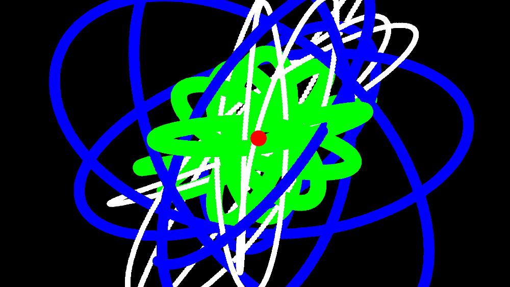

A couple of months ago I had some fun developing a gravity simulation thing in
Common Lisp. I pushed it to GitHub a few minutes ago, maybe I'll develop it a
bit further.

<figure></figure>

[Check it out!](https://github.com/jorams/gravity)
