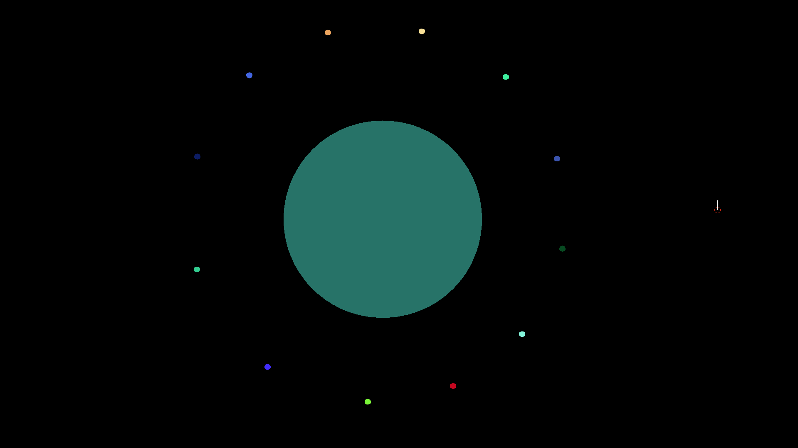

About three months ago I [wrote][] about
[my little gravity simulation][gravity]. I hoped writing something about it and
putting it on GitHub would help motivate me to improve it for a bit. Luckily, it
did. About a month ago I put in a couple of hours to improve the program and it
became much more fun to play with.

I added key bindings to make the world more dynamic. Instead of specifying the
planets in the universe in code, you now add them by hand. You can play around,
putting planets into an orbit around others, or just shooting them around in
general.

It's remarkable how much nicer the simulation became when I made the gravity
calculations a bit more realistic. During development you could see things come
together nicely, with each more accurate number making everything look a bit
more realistic.

Planets now merge when they touch each other. The merge mechanics are a little
bit tricky and I seem to always have some small bug in there, but it works
pretty well.

One thing I added that increases the fun even more, is the possibility to make
planets bounce on the screen edge. It makes absolutely no sense from the
perspective of a gravity simulation, but it does allow for some fun
possibilities. It's great to take a small planet size at a high speed and fire a
ton of them into some direction. Sometimes you can manage to have a ton of them
on screen without a lot of merges, drawing all kinds of patterns.

I'd like to develop this even further. One thing I want to implement is to allow
zooming in and out and panning the camera. That'd expand the possibilities for
implementing a full universe, because you could place large planets far enough
away from eachother that they don't interfere too much.

Code on [GitHub][gravity].

<figure></figure>

[wrote]: /blog/gravity-like-things/
[gravity]: https://github.com/jorams/gravity
